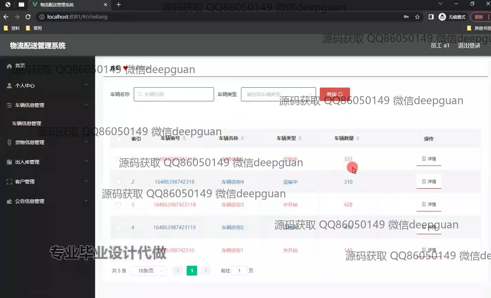
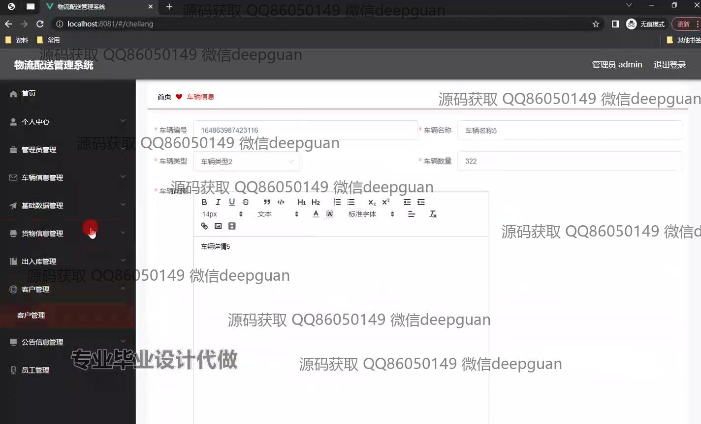

<h1 align="center">基于web的物流配送管理系统的设计与实现+vue</h1>

## 简介
物流配送管理系统：角色分为管理员、用户；功能包括车辆信息管理、订单管理、货物信息管理、出入库管理、客户管理，使用SSM框架与Vue实现，提升物流管理效率与用户体验。    --计算机毕业设计源码；毕设源码；java毕业设计源码

## 联系方式

<h3 align="center">获取完整代码与数据库文件 + 微信：deepguan QQ: 86050149 QQ群: 783742310</h3>

<h3 align="center">可帮忙远程部署 包运行成功！提供远程部署、修改代码、设计文档指导、代码讲解等服务！</h3>

## 功能介绍（完整见运行截图）
管理员：可管理车辆信息、订单状态、货物出入库流程。提供功能模块的导航，如个人中心、管理员管理、库存数据管理、员工管理，支持车辆和货物信息的输入与编辑，查询订单以及客户信息。提供添加、删除、修改和查询物流信息的权限，确保物流系统高效运行和信息更新。具备登录和退出功能，确保系统安全。

用户：访问与查询货物信息，查看车辆管理和订单状态，支持输入订单编号、货物信息及客户信息。通过导航栏访问不同的功能模块，如车辆管理、货物管理、订单状态查询等，提供图文货物详情，以便信息录入和订单管理。用户可与界面交互，增加订单的详细信息，包括送货地址和联系方式，使用简洁易懂的界面完成订单提交与取消操作。

## 运行截图

本代码来源于网络,仅供学习参考使用!

